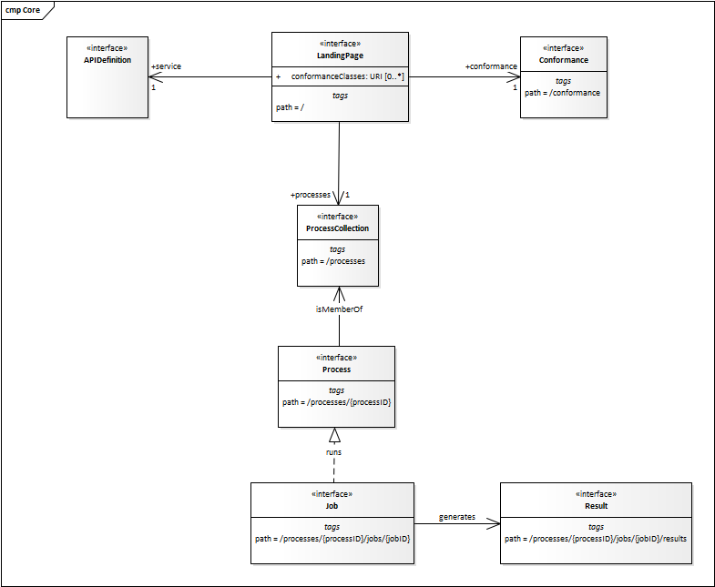

== Requirements Class "Core"

The following section describes the core requirements class.

=== Overview

include::requirements/requirements_class_core.adoc[]

A server that implements the OGC API - Processes provides access to processes.

Each OGC API - Processes has a single `LandingPage` (path `/`) that provides links to

* the `APIDefinition` (no fixed path),
* the `Conformance` statements (path `/conformance`),
* the `processes` metadata (path `/processes`).

The `APIDefinition` describes the capabilities of the server that can be used by
clients to connect to the server or by development tools to support the
implementation of servers and clients. Accessing the `APIDefinition` using
HTTP GET returns a description of the API.

Accessing the `Conformance` using HTTP GET returns a list of URIs of
requirements classes implemented by the server.

The list of processes contains a summary of each process the OGC API - Processes offers, including the link to a more detailed description of the process.

The process description contains information about inputs and outputs and a link to the execution-endpoint for the process. 

A HTTP POST request to the execution-endpoint creates a new job. The inputs and outputs need to be passed in a JSON execute-request.

The URL for accessing status information is delivered in the HTTP header `location`.

After a process is finished (status = success/failed), the results/exceptions can be retrieved.

[#img_core,reftext='{figure-caption} {counter:figure-num}']
.Resources in the Core requirements class

[[sc_landing_page]]
=== Retrieve the API landing page

The following section describes a method to retrieve an API landing page.

==== Operation

include::requirements/core/REQ_landingpage-op.adoc[]

==== Response

include::requirements/core/REQ_landingpage-success.adoc[]

.link:https://raw.githubusercontent.com/opengeospatial/wps-rest-binding/master/core/openapi/schemas/landingPage.yaml[Schema for the landing page]
[source,YAML]
----
include::openapi/schemas/landingPage.yaml[]
----

.Landing page response document
=================
[source,JSON]
----
include::examples/json/LandingPage.json[]
----
=================

==== Error situations

See <<http_status_codes>> for general guidance.

[[sc_api_definition]]
=== Retrieve an API definition

The following section describes a method to retrieve an API definition.

==== Operation

Every OGC API - Processes provides an API definition that describes the capabilities
of the server and which can be used by developers to understand the API,
by software clients to connect to the server, or
by development tools to support the implementation of servers and clients.

include::requirements/core/REQ_api-definition-op.adoc[]

==== Response

include::requirements/core/REQ_api-definition-success.adoc[]

include::recommendations/core/REC_api-definition-oas.adoc[]

If multiple API definition formats are supported by a server, use
content negotiation to select the desired representation.

The API definition document describes the API. In other words,
there is no need to include the `/api` operation in the API definition itself.

The idea is that any OGC API - Processes can be used by developers that are familiar with
the API definition language(s) supported by the server. For example, if
an OpenAPI definition is used, it should be possible to create a working
client using the OpenAPI definition. The developer may need to learn a little
bit about geometry data types, etc., but it should not be required to read
this standard to access the data via the API.

==== Error situations

See <<http_status_codes>> for general guidance.

[[sc_conformance_classes]]
=== Declaration of conformance classes

==== Operation

To support "generic" clients for accessing Web Processing Services in general - and
not "just" a specific API / server, the server has to declare the
requirements classes it implements and conforms to.

include::requirements/core/REQ_conformance-op.adoc[]

==== Response

include::requirements/core/REQ_conformance-success.adoc[]

.link:https://raw.githubusercontent.com/bpross-52n/wps-rest-oas/master/schemas/req-classes.yaml[Schema for the list of requirements classes]
[source,YAML]
----
include::openapi/schemas/confClasses.yaml[]
----

.Requirements class response document
=================
This example response in JSON is for a server that supports OpenAPI 3.0 for
the API definition and HTML and JSON as encodings.

[source,JSON]
----
include::examples/json/ConfClasses.json[]
----
=================

==== Error situations

See <<http_status_codes>> for general guidance.

=== Use of HTTP 1.1

include::requirements/core/REQ_http.adoc[]

[[http_status_codes]]
==== HTTP status codes

<<status_codes>> lists the main HTTP status codes that clients should be
prepared to receive.

This includes, for example, support for specific security schemes or URI
redirection.

In addition, other error situations may occur in the transport layer
outside of the server.

[#status_codes,reftext='{table-caption} {counter:table-num}']
.Typical HTTP status codes
[cols="15,85",options="header"]
!===
|Status code |Description
|`200` |A successful request.
|`201` |The request was successful and one or more new resources have being created.
|`400` |The server cannot or will not process the request due to an apparent client error. For example, a query parameter had an incorrect value.
|`401` |The request requires user authentication. The response includes a `WWW-Authenticate` header field containing a challenge applicable to the requested resource.
|`403` |The server understood the request, but is refusing to fulfill it. While status code `401` indicates missing or bad authentication, status code `403` indicates that authentication is not the issue, but the client is not authorized to perform the requested operation on the resource.
|`404` |The requested resource does not exist on the server. For example, a path parameter had an incorrect value.
|`405` |The request method is not supported. For example, a POST request was submitted, but the resource only supports GET requests.
|`406` |The `Accept` header submitted in the request did not support any of the media types supported by the server for the requested resource.
|`500` |An internal error occurred in the server.
!===

More specific guidance is provided for each resource, where applicable.

include::recommendations/core/PER_additional-status-codes.adoc[]

=== Support for cross-origin requests

To access data from a HTML page where the data is on another host than
the webpage is by default prohibited for security reasons ("same-origin policy").
A typical example is a web-application accessing processes and data from multiple servers.

include::recommendations/core/REC_cross-origin.adoc[]

Two common mechanisms to support cross-origin requests are:

* link:https://en.wikipedia.org/wiki/Cross-origin_resource_sharing[Cross-origin resource sharing (CORS)]
* link:https://en.wikipedia.org/wiki/JSONP[JSONP (JSON with padding)]

include::recommendations/core/REC_html.adoc[]

[[sc_process_collection]]
=== Retrieve a process collection

The following section describes a method to retrieve the available processes offered by the server.

==== Operation

include::requirements/core/REQ_process-collection-op.adoc[]

==== Response

include::requirements/core/REQ_process-collection-success.adoc[]

.link:https://raw.githubusercontent.com/opengeospatial/wps-rest-binding/master/core/openapi/schemas/processCollection.yaml[Schema for the process collection]
[source,YAML]
----
include::openapi/schemas/processCollection.yaml[]
----

[NOTE]
====
References to additional schemas can found in Annex TODO
====

.Example of HTTP GET request for retrieving the list of offered processes encoded as JSON.
[source]
----
https://processing.example.org/processes
----

.Example of Process list encoded as JSON.
[source,json]
----
include::examples/json/ProcessCollection.json[]
----

==== Error situations

See <<http_status_codes>> for general guidance.

[[sc_process_description]]
=== Retrieve a process description

The following section describes a method to retrieve metadata about a process.

==== Operation

include::requirements/core/REQ_process-op.adoc[]

==== Response

include::requirements/core/REQ_process-success.adoc[]

The <<rc_core,Core>> does not mandate the use of a specific process description
to specify the interface of a process.  That said, the <<rc_core,Core>>
requirements class makes the following recommendation:

include::recommendations/core/REC_ogc-process-description.adoc[]

==== Error situations

See <<http_status_codes>> for general guidance.

include::requirements/core/REQ_process-exception-no-such-process.adoc[]

[[sc_create_job]]
=== Create a new job

The following section describes a method to create a new job, i.e. execute a process.

==== Operation

include::requirements/core/REQ_job-creation-op.adoc[]

==== Request body

include::requirements/core/REQ_job-creation-request.adoc[]

.link:https://raw.githubusercontent.com/opengeospatial/wps-rest-binding/master/core/openapi/schemas/execute.yaml[Schema for execute]
[source,YAML]
----
include::openapi/schemas/execute.yaml[]
----

The creation of a job can be done synchronously or asynchronously. 

include::requirements/core/REQ_job-creation-mode.adoc[]

.Example of an execute request
[source, json]
----
include::examples/json/Execute.json[]
----

==== Response

In case of asynchronous execution, the requirements below apply:

include::requirements/core/REQ_job-creation-success-async.adoc[]

include::requirements/core/REQ_job-creation-success-async-header.adoc[]

For synchronous execution, the following requirement applies:

include::requirements/core/REQ_job-creation-success-sync.adoc[]

==== Error situations

See <<http_status_codes>> for general guidance.

If the process with the specified identifier doesn't exist on the server, the status code of the response will be `404` (see <<req_core_no-such-process>>).

[[sc_retrieve_status_info]]
=== Retrieve status information about a job

The following section describes a method to retrieve information about the status of a job.

==== Operation

include::requirements/core/REQ_job-op.adoc[]

==== Response

include::requirements/core/REQ_job-success.adoc[]

.link:https://raw.githubusercontent.com/opengeospatial/wps-rest-binding/master/core/openapi/schemas/statusInfo.yaml[Schema for status info]
[source,YAML]
----
include::openapi/schemas/statusInfo.yaml[]
----

.Example of HTTP GET request for retrieving status information about a job encoded as JSON.
[source]
----
http://processing.example.org/processes/EchoProcess/jobs/81574318-1eb1-4d7c-af61-4b3fbcf33c4f
----

.Example of a job encoded as JSON.
[source,json]
----
include::examples/json/StatusInfo.json[]
----

==== Error situations

See <<http_status_codes>> for general guidance.

If the process with the specified identifier doesn't exist on the server, the status code of the response will be `404` (see <<req_core_no-such-process>>).

include::requirements/core/REQ_job-exception-no-such-job.adoc[]

[[rc_retrieve_job_results]]
=== Retrieve job results

The following section describes a method to retrieve the results of a job. In case the job execution failed, an exception is returned.

==== Operation

include::requirements/core/REQ_job-result-op.adoc[]

==== Response

include::requirements/core/REQ_job-result-success.adoc[]

.link:https://raw.githubusercontent.com/opengeospatial/wps-rest-binding/master/core/openapi/schemas/result.yaml[Schema for the result of a job]
[source,YAML]
----
include::openapi/schemas/result.yaml[]
----

.link:https://raw.githubusercontent.com/opengeospatial/wps-rest-binding/master/core/openapi/schemas/outputInfo.yaml[Schema for output info]
[source,YAML]
----
include::openapi/schemas/outputInfo.yaml[]
----

.Example of HTTP GET request for retrieving the result a job encoded as JSON.
[source]
----
http://processing.example.org/processes/EchoProcess/jobs/81574318-1eb1-4d7c-af61-4b3fbcf33c4f/result
----

.Example of a result encoded as JSON.
[source,json]
----
include::examples/json/Result.json[]
----

==== Error situations

See <<http_status_codes>> for general guidance.

If the process with the specified id doesn't exist on the server, the status code of the response will be `404` (see <<req_core_no-such-process>>).

include::requirements/core/REQ_job-result-exception-no-such-job.adoc[]

include::requirements/core/REQ_job-result-exception-result-not-ready.adoc[]

include::requirements/core/REQ_job-result-failed.adoc[]
