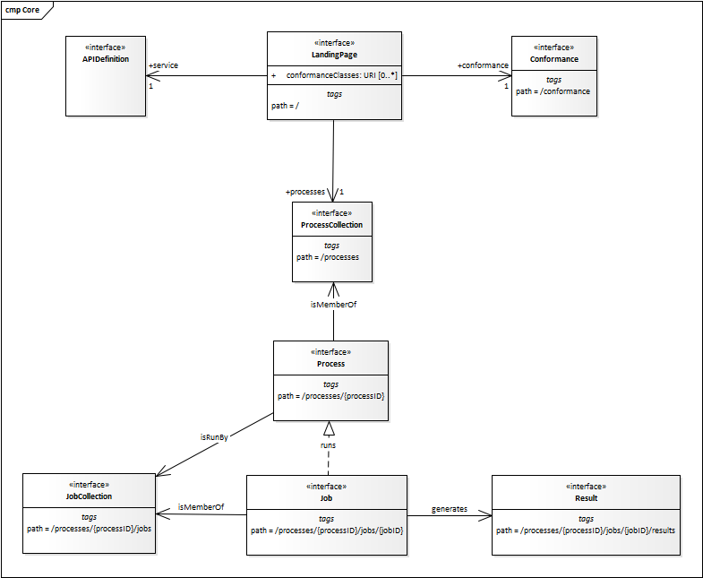

== Requirement Class "Core"

////
for now, normative statements are often included inline. This will be re-factored later.
////

=== Overview

include::requirements/requirements_class_core.adoc[]

TODO: Overview?

In addition, each server publishes a formal definition of the API (`APIDefinition`),
which describes the capabilities of the server and which can be used by
clients to connect to the server or
by development tools to support the implementation of servers and clients.

[#img_core,reftext='{figure-caption} {counter:figure-num}']
.Resources in the Core requirements class

CAUTION: link:https://github.com/opengeospatial/WFS_FES/issues/30[ISSUE 30] +
Allow also features that do not belong to any collection?

=== Retrieve API landing page

==== Operation

include::requirements/op/REQ_root-op.adoc[]

==== Response

include::requirements/op/REQ_root-success.adoc[]

.link:https://raw.githubusercontent.com/opengeospatial/WFS_FES/master/core/openapi/schemas/root.yaml[Schema for the landing page]
[source,YAML]
----
type: object
required:
  - links
properties:
  links:
    type: array
    items:
      $ref: https://raw.githubusercontent.com/opengeospatial/WFS_FES/master/core/openapi/schemas/link.yaml
----

.Landing page response document
=================
[source,JSON]
----
{
  "links": [
    { "href": "http://data.example.org/",
      "rel": "self", "type": "application/json", "title": "this document" },
    { "href": "http://data.example.org/api",
      "rel": "service", "type": "application/openapi+json;version=3.0", "title": "the API definition" },
    { "href": "http://data.example.org/conformance",
      "rel": "conformance", "type": "application/json", "title": "WFS 3.0 conformance classes implemented by this server" },
    { "href": "http://data.example.org/collections",
      "rel": "data", "type": "application/json", "title": "Metadata about the feature collections" }
  ]
}
----
=================

==== Error situations

=== Retrieve API definition

==== Operation

Every WFS provides an API definition that describes the capabilities
of the server and which can be used by developers to understand the API,
by software clients to connect to the server, or
by development tools to support the implementation of servers and clients.

include::requirements/core/REQ_api-definition-op.adoc[]

==== Response

include::requirements/core/REQ_api-definition-success.adoc[]

include::requirements/core/REC_api-definition-oas.adoc[]

If multiple API definition formats are supported by a server, use
content negotiation to select the desired representation.

The API definition document describes the API. In other words,
there is no need to include the `/api` operation in the API definition itself.

The idea is that any WFS can be used by developers that are familiar with
the API definition language(s) supported by the server. For example, if
an OpenAPI definition is used, it should be possible to create a working
client using the OpenAPI definition. The developer may need to learn a little
bit about geometry data types, etc., but it should not be required to read
this standard to access the data via the API.

==== Error situations

See <<http_status_codes>> for general guidance.

See <<http_status_codes>> for general guidance.

Reqirement

Operation

Response

URL-Example

Schema

Example

Errors

=== HTTP 1.1

[width="90%",cols="2,6a"]
|===
|*Requirement {counter:req-id}* |/req/core/http +

The server SHALL conform to <<rfc2616,HTTP 1.1>>.
|===

This includes the correct use of status codes, headers, etc.

[[http_status_codes]]
==== HTTP status codes

<<status_codes>> lists the main HTTP status codes that clients should be
prepared to receive.

This includes, for example, support for specific security schemes or URI
redirection.

In addition, other error situations may occur in the transport layer
outside of the server.

[#status_codes,reftext='{table-caption} {counter:table-num}']
.Typical HTTP status codes
[cols="15,85",options="header"]
!===
|Status code |Description
|`200` |A successful request.
|`304` |An <<web_caching,entity tag was provided in the request>> and the resource has not been changed since the previous request.
|`400` |The server cannot or will not process the request due to an apparent client error. For example, a query parameter had an incorrect value.
|`401` |The request requires user authentication. The response includes a `WWW-Authenticate` header field containing a challenge applicable to the requested resource.
|`403` |The server understood the request, but is refusing to fulfill it. While status code `401` indicates missing or bad authentication, status code `403` indicates that authentication is not the issue, but the client is not authorised to perform the requested operation on the resource.
|`404` |The requested resource does not exist on the server. For example, a path parameter had an incorrect value.
|`405` |The request method is not supported. For example, a POST request was submitted, but the resource only supports GET requests.
|`406` |The `Accept` header submitted in the request did not support any of the media types supported by the server for the requested resource.
|`500` |An internal error occurred in the server.
!===

More specific guidance is provided for each resource, where applicable.

include::requirements/core/PER_additional-status-codes.adoc[]

=== Web caching

Entity tags are a mechanism for web cache validation and for supporting conditional
requests to reduce network traffic. Entity tags are specified by <<rfc2616,HTTP/1.1 (RFC 2616)>>.

[[rec_etag]]
[width="90%",cols="2,6a"]
|===
|Recommendation {counter:rec-id} |/rec/core/etag +

The service SHOULD support entity tags and the associated headers as
specified by HTTP/1.1.
|===

NOTE: TODO +
Add an example OpenAPI operation (headers, response codes). Here or in clause 9.

=== Support for cross-origin requests

To access data from a HTML page where the data is on another host than
the webpage is by default prohibited for security reasons ("same-origin policy").
A typical example is a web-application accessing feature data from
multiple distributed datasets.

[width="90%",cols="2,6a"]
|===
|Recommendation {counter:rec-id} |/rec/core/cross-origin +

If the server is intended to be accessed from the browser, cross-origin
requests SHOULD be supported. Note that support can also be added in a
proxy layer on top of the server.
|===

Two common mechanisms to support cross-origin requests are:

* link:https://en.wikipedia.org/wiki/Cross-origin_resource_sharing[Cross-origin resource sharing (CORS)]
* link:https://en.wikipedia.org/wiki/JSONP[JSONP (JSON with padding)]

[[rec_html]]
[width="90%",cols="2,6a"]
|===
|Recommendation {counter:rec-id} |/rec/core/html +

To support browsing a WPS with a web browser and to enable search engines to crawl
and index a dataset, implementations SHOULD consider to support an HTML encoding.
|===

<<overview,Clause 6 (Overview)>> includes a discussion about the recommended
encodings.

A template for the definition of the parameter `f` in YAML according to OpenAPI 3.0 is available at
link:https://raw.githubusercontent.com/opengeospatial/WFS_FES/master/core/openapi/parameters/f.yaml[f.yaml].

=== Retrieve a process collection

TBD

==== Operation

include::requirements/op/REQ_process-collection-op.adoc[]

==== Response

include::requirements/op/REQ_process-collection-success.adoc[]

.link:https://raw.githubusercontent.com/opengeospatial/wps-rest-binding/master/core/openapi/schemas/processCollection.yaml[Schema for the process collection]
[source,YAML]
----
type: object
required:
  - processes
properties:
  processes:
    type: array
    items:
      $ref: '#/components/schemas/processSummary'
----

==== Error situations

.Example of HTTP GET request for retrieving the list of offered processes encoded as JSON.
[source]
----
http://hostname.org/wps-rest/processes
----

.Example of Process list encoded as JSON.
[source,json]
----
{
  "ProcessSummaries": [
    {
      "identifier": "ConvexHullAlgorithm",
      "title": "Convex Hull Algorithm",
      "processVersion": "1.0.0",
      "jobControlOptions": "sync-execute async-execute",
      "processDescription": "http://hostname.org/wps-rest/processes/ConvexHullAlgorithm"
    },...
    ]
}
----

=== Retrieve a process

TBD

==== Operation

include::requirements/op/REQ_process-op.adoc[]

==== Response

include::requirements/op/REQ_process-success.adoc[]

.link:https://raw.githubusercontent.com/opengeospatial/wps-rest-binding/master/core/openapi/schemas/processCollection.yaml[Schema for a process]
[source,YAML]
----
type: object
required:
  - process
properties:
   process:
      $ref: '#/components/schemas/process'
----

==== Error situations

.Example of HTTP GET request for retrieving a process encoded as JSON.
[source]
----
http://hostname.org/wps-rest/processes/buffer
----

.Example of a process encoded as JSON.
[source,json]
----
{
  "process": {
    "id": "buffer",
    "title": "Example process",
    "abstract": "Example process",
    "keywords": [
      "example",
      "process",
      "buffer"
    ],
    "inputs": [
      {
        "id": "features",
        "title": "features",
        "abstract": "The features to buffer",
        "formats": [
          {
            "mimeType": "application/json",
            "maximumMegabytes": 3,
            "default": true
          },
          {
            "mimeType": "application/x-zipped-shp",
            "maximumMegabytes": 3
          }
        ]
      },
      {
        "id": "width",
        "title": "width",
        "abstract": "The buffer width",
        "formats": [
          {
            "mimeType": "text/plain"
          }
        ],
        "literalDataDomain": {
          "dataType": "double",
          "valueDefinition": {
            "defaultValue": "1000"
          },
          "uom": "meters"
        }
      }
    ],
    "outputs": [
      {
        "id": "result",
        "title": "result",
        "abstract": "The buffered features",
        "formats": [
          {
            "mimeType": "application/json",
            "default": true
          },
          {
            "mimeType": "application/x-zipped-shp"
          }
        ]
      }
    ],
    "version": 1.1,
    "jobControlOptions": [
      "sync-execute",
      "async-execute"
    ],
    "outputTransmission": [
      "value",
      "reference"
    ],
    "executeEndpoint": "https://virtserver.swaggerhub.com/geoprocessing/WPS/0.01/processes/buffer"
  }
}
----

=== Retrieve a job collection

TBD

==== Operation

include::requirements/op/REQ_job-collection-op.adoc[]

==== Response

include::requirements/op/REQ_job-collection-success.adoc[]

.link:https://raw.githubusercontent.com/opengeospatial/wps-rest-binding/master/core/openapi/schemas/jobList.yaml[Schema for the job collection]
[source,YAML]
----
type: object
properties:
    jobs:
       type: array
       items:
          type: string
----

==== Error situations

.Example of HTTP GET request for retrieving the list of jobs of a process encoded as JSON.
[source]
----
http://hostname.org/wps-rest/processes/buffer/jobs
----

.Example of a job list encoded as JSON.
[source,json]
----
{
  "jobs": [
    "8f5c13b9-6da2-4447-a683-69a5f364323b",
    "904358bd-a151-49f3-af74-79edf7ccb288"
  ]
}
----

=== Create a new job

TBD

==== Operation

include::requirements/op/REQ_job-creation-op.adoc[]

==== Request

include::requirements/op/REQ_job-creation-request.adoc[]

.link:https://raw.githubusercontent.com/opengeospatial/wps-rest-binding/master/core/openapi/schemas/execute.yaml[Schema for execute]
[source,YAML]
----
type: object
required:
    - outputs
properties:
    inputs:
       type: array
       items:
            $ref: '#/components/schemas/input'
    outputs:
       type: array
       items:
            $ref: '#/components/schemas/output'
----

.Example of an execute request
[source, json]
----
{
  "inputs": [
    {
      "id": "features",
      "format": {
        "mimeType": "application/json"
	  },
      "value": {
	     "valueReference": "http://data.org/features.json"  
	  }
    },
    {
      "id": "width",
      "format": {
        "mimeType": "text/plain"
	  },
      "value": {
	     "inlineValue": "2000"  
	  }
    }
  ],
  "outputs": [
    {
      "id": "result",
      "format": {
        "mimeType": "application/json"
      },
      "transmissionMode": "value"
    }
  ]
}
----

==== Response

include::requirements/op/REQ_job-creation-success.adoc[]

include::requirements/op/REQ_job-creation-success-header.adoc[]

==== Error situations

=== Retrieve a job

TBD

==== Operation

include::requirements/op/REQ_job-op.adoc[]

==== Response

include::requirements/op/REQ_job-success.adoc[]

.link:https://raw.githubusercontent.com/opengeospatial/wps-rest-binding/master/core/openapi/schemas/execute.yaml[Schema for execute]
[source,YAML]
----
type: object
required:
    - status
properties:
   status:
      type: string
      enum:
        - accepted
        - running
        - successful
        - failed
message:
   type: string
progress:
   type: integer
   minimum: 0
   maximum: 100
----

.Example of HTTP GET request for retrieving a job of a process encoded as JSON.
[source]
----
http://hostname.org/wps-rest/processes/buffer/jobs/81574318-1eb1-4d7c-af61-4b3fbcf33c4f
----

.Example of a job encoded as JSON.
[source,json]
----
{
  "status": "accepted",
  "message": "Process started",
  "progress": 0
}
----

==== Error situations

=== Retrieve a job result

TBD

==== Operation

include::requirements/op/REQ_job-result-op.adoc[]

==== Response

include::requirements/op/REQ_job-result-success.adoc[]

.link:https://raw.githubusercontent.com/opengeospatial/wps-rest-binding/master/core/openapi/schemas/result.yaml[Schema for result]
[source,YAML]
----
type: object
required:
    - outputs
properties:
   outputs:
       type: array
       items:
          $ref: '#/components/schemas/outputInfo'
----

==== Error situations

.Example of HTTP GET request for retrieving a job of a process encoded as JSON.
[source]
----
http://hostname.org/wps-rest/processes/buffer/jobs/81574318-1eb1-4d7c-af61-4b3fbcf33c4f
----

.Example of a job encoded as JSON.
[source,json]
----
{
  "outputs": [
    {
      "id": "output1",
      "value": "0.6"
    },
    {
      "id": "output2",
      "value": "http://hostname.org/wps-rest/result/7j4g5325ge"
    }
  ]
}
----